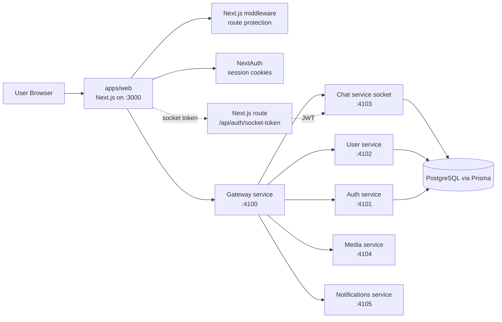
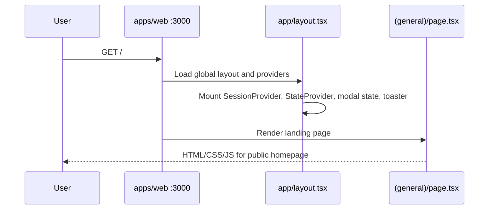
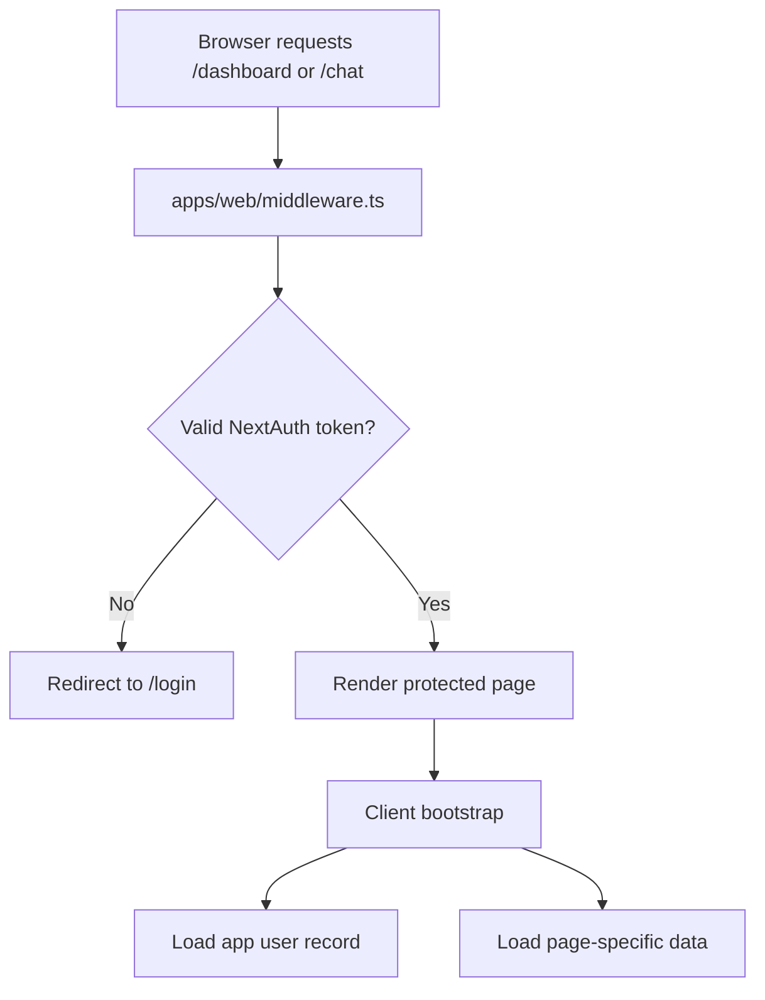
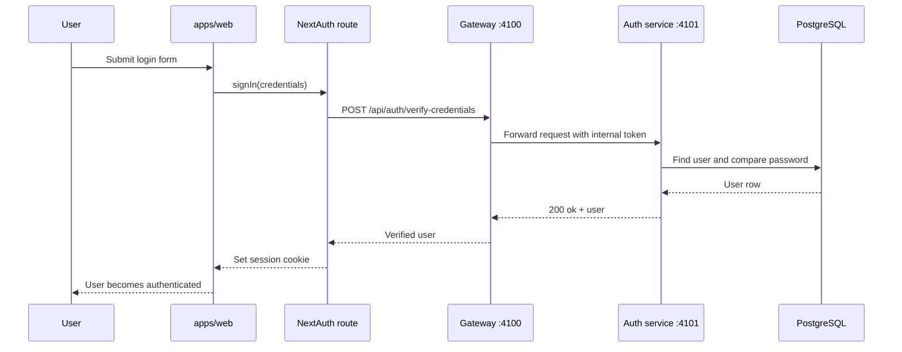
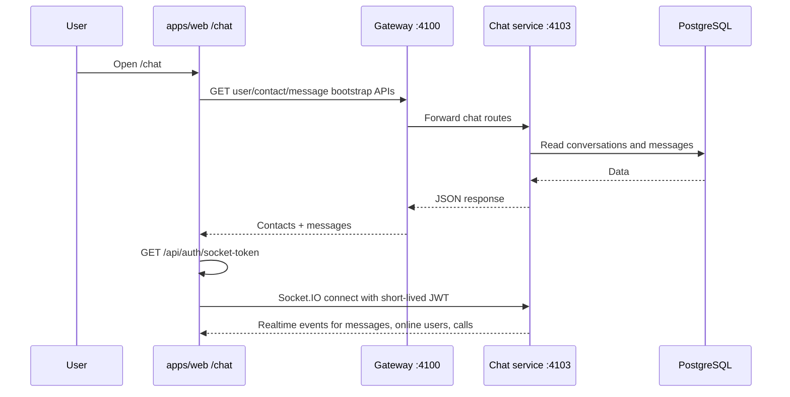
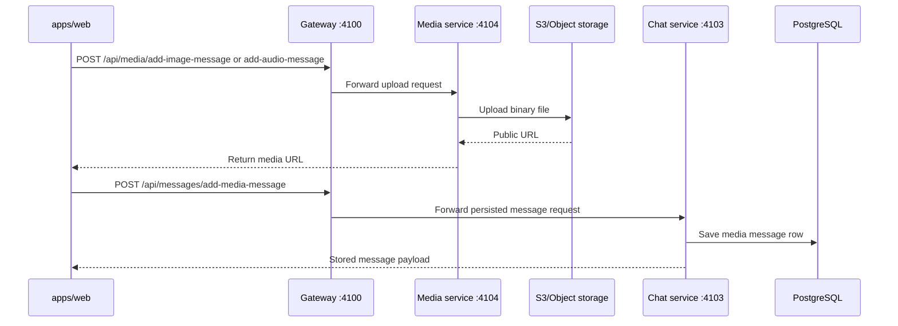

# Yome `localhost:3000` Request Workflow

This document shows the real request flow for a user opening Yome on `http://localhost:3000`, and the main directories and files involved in that flow.

It focuses on:

- the first browser request to the Next.js app
- how protected pages are authorized
- how frontend requests reach the gateway and microservices
- how chat uses both REST and Socket.IO
- where the important files live

## 1. High-Level Runtime Map



## 2. Directory View For This Flow

```text
Yome/
├── apps/
│   └── web/
│       ├── app/
│       │   ├── layout.tsx
│       │   ├── (general)/
│       │   │   ├── page.tsx
│       │   │   └── (authentication)/login/page.tsx
│       │   ├── (main)/
│       │   │   ├── layout.tsx
│       │   │   └── (dashboard)/dashboard/page.tsx
│       │   ├── (communication)/
│       │   │   └── chat/page.tsx
│       │   └── api/
│       │       └── auth/
│       │           ├── [...nextauth]/
│       │           │   ├── route.ts
│       │           │   └── options.ts
│       │           ├── socket-token/route.ts
│       │           └── sync-user/route.ts
│       ├── context/
│       │   ├── AuthProvider.tsx
│       │   └── StateContext.tsx
│       ├── hooks/
│       │   └── useChatSocket.ts
│       ├── lib/
│       │   ├── auth/userInfo.ts
│       │   ├── chat/chatApi.ts
│       │   └── dashboard/dashboardApi.ts
│       ├── middleware.ts
│       └── utils/ApiRoutes.ts
├── services/
│   ├── gateway/src/index.ts
│   ├── auth/src/
│   │   ├── index.ts
│   │   ├── routes/auth.routes.ts
│   │   ├── routes/db.routes.ts
│   │   └── controllers/auth.controller.ts
│   ├── user/src/
│   │   ├── index.ts
│   │   ├── routes/user.routes.ts
│   │   └── controllers/user.controller.ts
│   ├── chat/src/
│   │   ├── index.ts
│   │   ├── routes/chat.routes.ts
│   │   ├── controllers/message.controller.ts
│   │   ├── socket/handlers.ts
│   │   └── state/online-users.ts
│   ├── media/src/
│   │   ├── index.ts
│   │   ├── routes/media.routes.ts
│   │   └── controllers/media.controller.ts
│   └── notifications/src/index.ts
└── packages/
    ├── database/
    │   ├── prisma/schema.prisma
    │   └── src/generated/client/
    └── shared/src/
        ├── config/env.ts
        ├── middleware/internalTokenGuard.ts
        ├── middleware/validateRequest.ts
        └── storage/s3.ts
```

## 3. Flow A: User Opens `http://localhost:3000`

This is the simplest path.



### Main files used

- `apps/web/app/layout.tsx`
- `apps/web/context/AuthProvider.tsx`
- `apps/web/context/StateContext.tsx`
- `apps/web/app/(general)/page.tsx`

### What actually happens

1. The browser hits the Next.js app running from `apps/web` on port `3000`.
2. `app/layout.tsx` loads global CSS and wraps the app with shared providers.
3. `AuthProvider.tsx` mounts NextAuth's `SessionProvider`.
4. `app/(general)/page.tsx` renders the public landing page.
5. No microservice is required just to render `/`.

## 4. Flow B: User Opens A Protected Page Like `/dashboard` Or `/chat`

Protected routes go through Next.js middleware first.



### Main files used

- `apps/web/middleware.ts`
- `apps/web/app/(main)/layout.tsx`
- `apps/web/app/(main)/(dashboard)/dashboard/page.tsx`
- `apps/web/app/(communication)/chat/page.tsx`
- `apps/web/lib/auth/userInfo.ts`

### What actually happens

1. The request reaches `apps/web/middleware.ts`.
2. `withAuth(...)` checks for a NextAuth session token.
3. If the user is not authenticated, Yome redirects to `/login`.
4. If authenticated, the protected page renders inside `app/(main)/layout.tsx` or the chat route.
5. Client-side bootstrap code calls `ensureUserInfo(...)` in `apps/web/lib/auth/userInfo.ts` to turn the session into the app's own user record.

## 5. Flow C: Login And Session Creation

The frontend login page delegates credential verification to NextAuth, and NextAuth delegates credential checking to the auth microservice through the gateway.



### Main files used

- `apps/web/app/(general)/(authentication)/login/page.tsx`
- `apps/web/app/api/auth/[...nextauth]/route.ts`
- `apps/web/app/api/auth/[...nextauth]/options.ts`
- `apps/web/utils/ApiRoutes.ts`
- `services/gateway/src/index.ts`
- `services/auth/src/routes/auth.routes.ts`
- `services/auth/src/controllers/auth.controller.ts`
- `packages/database/prisma/schema.prisma`

## 6. Flow D: How Frontend REST Calls Reach The Microservices

For most REST operations, the frontend does not call the auth/user/chat/media services directly. It calls the gateway on port `4100`.

```mermaid
flowchart LR
    A[apps/web code] --> B[utils/ApiRoutes.ts]
    B --> C[NEXT_PUBLIC_BACKEND_API<br/>http://localhost:4100]
    C --> D[services/gateway/src/index.ts]
    D --> E[/api/auth -> auth service]
    D --> F[/api/user -> user service]
    D --> G[/api/messages or /api/chat -> chat service]
    D --> H[/api/media -> media service]
    D --> I[/api/notifications -> notifications service]
```

### Important frontend callers

- `apps/web/lib/auth/userInfo.ts`
  - calls `GET_USER_ROUTE`
- `apps/web/lib/dashboard/dashboardApi.ts`
  - calls user/group suggestion endpoints
- `apps/web/lib/chat/chatApi.ts`
  - calls chat history, conversation, and send-message endpoints
- `apps/web/utils/ApiRoutes.ts`
  - defines the actual backend URLs

### Important gateway behavior

Inside `services/gateway/src/index.ts`, the gateway:

1. accepts browser requests on port `4100`
2. validates auth unless the route is public
3. decodes the browser session cookie when needed
4. adds `x-internal-token` for downstream services
5. adds `x-user-id` and `x-user-email` for authenticated requests
6. proxies the request to the correct microservice

### Why this matters

Downstream services are protected by `packages/shared/src/middleware/internalTokenGuard.ts`, which means they expect the gateway to be the trusted entry point.

## 7. Flow E: Chat Page Workflow

The chat page uses both REST and realtime sockets.



### Main files used

- `apps/web/app/(communication)/chat/page.tsx`
- `apps/web/hooks/useChatSocket.ts`
- `apps/web/lib/chat/chatApi.ts`
- `apps/web/app/api/auth/socket-token/route.ts`
- `services/chat/src/index.ts`
- `services/chat/src/routes/chat.routes.ts`
- `services/chat/src/controllers/message.controller.ts`
- `services/chat/src/socket/handlers.ts`
- `services/chat/src/state/online-users.ts`

### Chat split: REST vs Socket

REST handles:

- initial contacts
- initial messages
- creating direct conversations
- persisting text/media message records

Socket.IO handles:

- online presence
- message push events
- read receipts
- incoming voice/video call events

### Why socket traffic bypasses the gateway

The frontend uses:

- `NEXT_PUBLIC_BACKEND_API=http://localhost:4100` for REST
- `NEXT_PUBLIC_CHAT_SOCKET_URL=http://localhost:4103` for sockets

That setup is defined in:

- `apps/web/utils/ApiRoutes.ts`
- the root `.env`

So chat websocket traffic connects directly to the chat service.

## 8. Flow F: Media Upload In Chat

When a user sends an image or audio message, Yome uses both the media service and the chat service.



### Main files used

- `apps/web/lib/chat/chatApi.ts`
- `services/media/src/routes/media.routes.ts`
- `services/media/src/controllers/media.controller.ts`
- `packages/shared/src/storage/s3.ts`
- `services/chat/src/controllers/message.controller.ts`

## 9. Service Ports Used In This Workflow

These defaults come from `packages/shared/src/config/env.ts` and the root `.env`.

- `3000`: Next.js frontend in `apps/web`
- `4100`: gateway
- `4101`: auth service
- `4102`: user service
- `4103`: chat service and Socket.IO
- `4104`: media service
- `4105`: notifications service

## 10. Short Summary

When a user requests `localhost:3000`, they are hitting the Next.js frontend in `apps/web`, not the microservices directly.

From there:

1. public pages render directly in Next.js
2. protected pages are checked by `apps/web/middleware.ts`
3. most backend REST calls go to the gateway on `:4100`
4. the gateway forwards them to auth, user, chat, media, or notifications
5. chat realtime events connect directly to the chat service on `:4103`
6. auth, user, and chat data finally live in PostgreSQL through Prisma in `packages/database`
