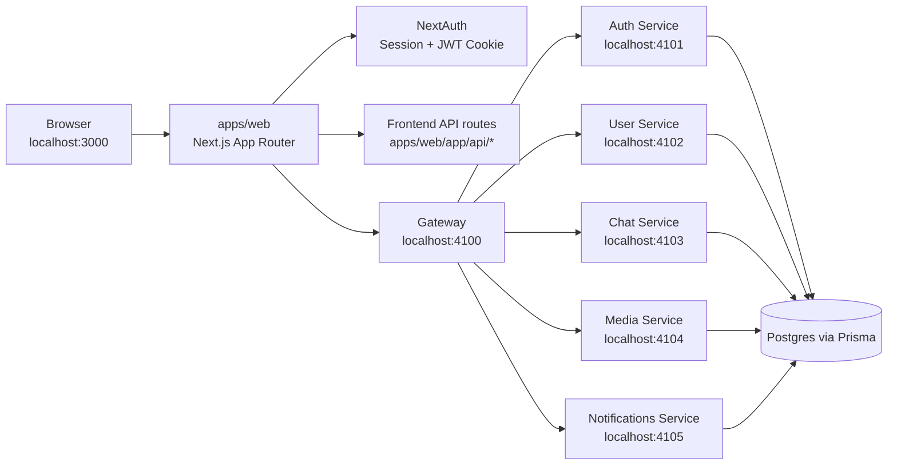
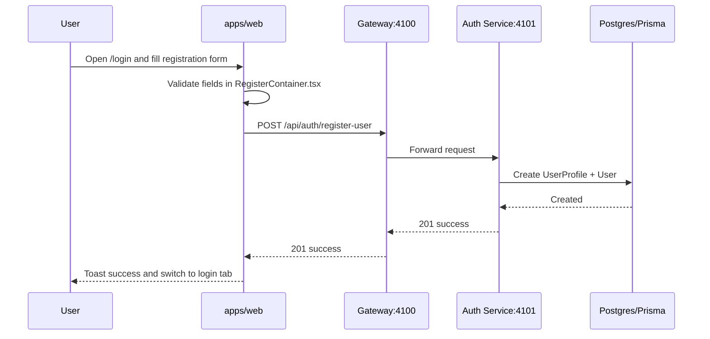
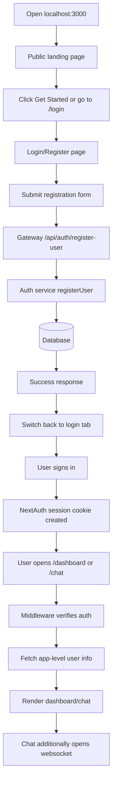

# Yome Project Architecture And Workflows

This document explains how the Yome monorepo is structured and what happens when a user:

- opens `http://localhost:3000`
- navigates to the sign up page
- submits the registration form
- logs in and reaches protected pages such as `/dashboard` and `/chat`

It also includes the main files and folders involved in each step.

## 1. Monorepo Layout

Yome is a Bun + Turbo monorepo with a Next.js frontend and several backend microservices.

### Top-level folders

- `apps/web`
  - Next.js frontend
  - owns UI routes, NextAuth, client-side state, and frontend API bridge routes
- `services/gateway`
  - API gateway
  - central entry point for frontend-to-backend traffic
- `services/auth`
  - registration, credential verification, OAuth user upsert, password changes, seed endpoints
- `services/user`
  - profile reads and updates
- `services/chat`
  - chat HTTP APIs and Socket.IO realtime connection
- `services/media`
  - media-related APIs
- `services/notifications`
  - notification APIs
- `packages/database`
  - Prisma schema and shared DB client
- `packages/shared`
  - shared data, constants, and utility modules

## 2. High-Level Architecture



## 3. Frontend Entry Flow: Visiting `localhost:3000`

When a user opens `http://localhost:3000`, the request starts in the frontend app.

### Files involved

- `apps/web/app/layout.tsx`
- `apps/web/context/AuthProvider.tsx`
- `apps/web/app/(general)/page.tsx`
- `apps/web/app/(general)/components/Navbar.tsx`

### What happens

1. Next.js loads `apps/web/app/layout.tsx`.
2. The global providers are mounted:
   - `AuthProvider`
   - `ModalContextProvider`
   - `StateProvider`
   - `Toaster`
3. `AuthProvider` wraps the app with `SessionProvider` from NextAuth.
4. The root page component `apps/web/app/(general)/page.tsx` renders the public landing page.
5. The landing page CTA points users toward `/login`.

### Result

- Anonymous users see the public marketing/home page.
- No backend auth call is required just to render the landing page.

## 4. Protected Route Gatekeeping

Protected pages are guarded before rendering.

### Files involved

- `apps/web/middleware.ts`
- `apps/web/app/api/auth/[...nextauth]/options.ts`

### Protected routes

- `/dashboard`
- `/account`
- `/chat`
- `/userfeeds`

### What happens

1. The middleware runs for matched routes.
2. `withAuth` checks whether a valid NextAuth token exists.
3. If no token exists, the user is redirected to `/login`.
4. If a token exists, the request continues.

### Result

- The dashboard, chat, and account pages depend on a working login session.

## 5. Sign Up Page Flow

The sign up UI is not a separate standalone route. It lives inside the `/login` page as a tab.

### Files involved

- `apps/web/app/(general)/(authentication)/login/page.tsx`
- `apps/web/app/(general)/(authentication)/login/components/RegisterContainer.tsx`
- `apps/web/app/(general)/(authentication)/login/components/LoginContainer.tsx`

### What happens

1. The user navigates to `/login`.
2. `login/page.tsx` renders both login and register panels.
3. If the user is already authenticated, the page redirects them to `/dashboard`.
4. If not authenticated, the user can switch to the registration tab.
5. `RegisterContainer.tsx` renders the registration form fields:
   - `firstname`
   - `lastname`
   - `username`
   - `email`
   - `password`
   - `confirmPassword`

### Important frontend validation

`RegisterContainer.tsx` applies client-side checks before calling the backend, including:

- required fields
- password confirmation
- username format validation

## 6. Registration Submission Workflow

This is the core path when a user completes the sign up form.

### Files involved

Frontend:

- `apps/web/app/(general)/(authentication)/login/components/RegisterContainer.tsx`
- `apps/web/utils/ApiRoutes.ts`

Gateway:

- `services/gateway/src/index.ts`

Auth service:

- `services/auth/src/routes/auth.routes.ts`
- `services/auth/src/controllers/auth.controller.ts`

Database:

- `packages/database/prisma/schema.prisma`
- `packages/database/src/client.js`

### Request path

1. `RegisterContainer.tsx` submits a POST request to:
   - `REGISTER_USER`
2. `REGISTER_USER` is defined in `apps/web/utils/ApiRoutes.ts` as:
   - `${NEXT_PUBLIC_BACKEND_API || "http://localhost:4100"}/api/auth/register-user`
3. The request reaches the gateway on port `4100`.
4. The gateway treats `/api/auth/register-user` as a public auth route and forwards it to the auth service.
5. The auth service receives the request on port `4101`.
6. `registerUser` in `services/auth/src/controllers/auth.controller.ts` validates and writes the new user to the database.
7. Prisma creates:
   - a `UserProfile`
   - a `User`
8. The auth service returns a success response.
9. The frontend shows a success toast and switches the UI back to the login tab.

### Important current behavior

Registration does **not** automatically log the user in.

After successful registration, the user still needs to log in manually from the login tab.

## 7. Registration Sequence Diagram



## 8. What Happens Next After Registration

After registration succeeds, the next expected workflow is login.

### Files involved

- `apps/web/app/(general)/(authentication)/login/components/LoginContainer.tsx`
- `apps/web/app/api/auth/[...nextauth]/options.ts`
- `apps/web/app/api/auth/[...nextauth]/route.ts`
- `services/auth/src/controllers/auth.controller.ts`

### Credential login flow

1. The user enters email and password in `LoginContainer.tsx`.
2. The component calls `signIn("credentials", { ... })`.
3. NextAuth uses the Credentials provider from `options.ts`.
4. The provider posts credentials to:
   - `VERIFY_CREDENTIALS_ROUTE`
5. That route points to the gateway:
   - `/api/auth/verify-credentials`
6. The gateway forwards the request to the auth service.
7. The auth service verifies the password with bcrypt.
8. If valid, NextAuth stores session data in its JWT/session cookie.
9. The user can now access protected pages.

## 9. Dashboard Workflow After Login

### Files involved

- `apps/web/middleware.ts`
- `apps/web/app/(main)/(dashboard)/dashboard/page.tsx`
- `apps/web/lib/auth/userInfo.ts`
- `apps/web/app/(main)/(dashboard)/dashboard/components/facebook/DashboardShell.tsx`
- `apps/web/app/(main)/(dashboard)/dashboard/components/facebook/TopNav.tsx`
- `services/gateway/src/index.ts`
- `services/auth/src/routes/auth.routes.ts`

### What happens

1. The user opens `/dashboard`.
2. `middleware.ts` checks for a valid session token.
3. If authorized, `dashboard/page.tsx` renders.
4. The page calls `ensureUserInfo(...)`.
5. `ensureUserInfo` posts to `GET_USER_ROUTE` through the gateway.
6. The auth service resolves the app-level user record using the session email.
7. The frontend stores the returned user details in shared state.
8. `DashboardShell` renders the main app shell.
9. `TopNav` uses the resolved user profile image if available, otherwise falls back to a default avatar.

### Why this step matters

NextAuth session data is not the only user source in this app.

The dashboard often needs the database-backed application user, including fields like:

- `username`
- `profilePicture`
- app-specific IDs
- profile metadata

## 10. Chat Workflow After Login

The chat page depends on both page authorization and a separate realtime socket token flow.

### Files involved

- `apps/web/app/(communication)/chat/page.tsx`
- `apps/web/hooks/useChatSocket.ts`
- `apps/web/app/api/auth/socket-token/route.ts`
- `services/chat/src/index.ts`

### What happens

1. The user opens `/chat`.
2. Middleware ensures the user is authenticated.
3. The chat page loads user information with `ensureUserInfo`.
4. `useChatSocket.ts` requests a socket token from:
   - `/api/auth/socket-token`
5. The frontend route decodes the active session and returns a short-lived JWT.
6. The client uses that token to open a Socket.IO connection to the chat service.
7. The chat service validates the token with `NEXTAUTH_SECRET`.
8. Once the websocket connection succeeds, realtime chat features become available.

### Failure mode to watch

If `/chat` keeps loading and the UI reports:

- `initial WS connection could not be established`

that usually means one of these layers is failing:

- session cookie generation
- socket token route
- chat service startup
- socket URL configuration
- websocket auth validation

## 11. OAuth And User Sync Workflow

The app also supports OAuth login providers and then syncs those users into the local database.

### Files involved

- `apps/web/app/api/auth/[...nextauth]/options.ts`
- `apps/web/app/api/auth/sync-user/route.ts`
- `apps/web/lib/auth/userInfo.ts`
- `services/auth/src/controllers/auth.controller.ts`

### What happens

1. A user signs in with Google, GitHub, or Facebook.
2. NextAuth receives provider profile data.
3. The `signIn` callback posts to the gateway route for OAuth/local user upsert.
4. The auth service creates or reuses a local user record.
5. Later, `ensureUserInfo` can fetch the full database user.
6. In development, `/api/auth/sync-user` can also backfill the local app user if the session exists but the DB record is missing.

## 12. Seed Data Workflow

The project includes development seed endpoints, but they are intentionally guarded.

### Files involved

- `apps/web/app/api/dev/db/seed-users/route.ts`
- `apps/web/app/api/dev/db/seed-groups/route.ts`
- `apps/web/app/api/dev/db/reset/route.ts`
- `apps/web/app/api/dev/db/_lib/devDbProxy.ts`
- `services/auth/src/routes/db.routes.ts`
- `services/auth/src/controllers/seed.controller.ts`
- `.env`

### Seeding in Terminal

```
curl -X POST http://localhost:3000/api/dev/db/seed-users

curl -X POST http://localhost:3000/api/dev/db/seed-groups

curl -X POST http://localhost:3000/api/dev/db/reset \
  -H "x-dev-seed-token: $DEV_SEED_ROUTE_TOKEN"
```

### What happens

1. Frontend dev-only database routes forward seed requests to the gateway.
2. The gateway forwards them to auth service DB routes.
3. The auth service performs bulk create or update operations.
4. These routes are only intended for local development.
5. They are controlled by `ENABLE_DEV_SEED_ROUTES` in `.env`.
6. The destructive reset route also requires `DEV_SEED_ROUTE_TOKEN`.

### Practical meaning

- If seed routes are disabled, the app can still work with manually created users.
- If seed routes are enabled, you can populate demo users and groups.
- Seeded avatars and profile pictures can explain why a profile image appears even if the current user did not upload one manually.

## 13. End-To-End Workflow Map



## 14. Most Important Files By Concern

### Public entry and layout

- `apps/web/app/layout.tsx`
- `apps/web/app/(general)/page.tsx`

### Authentication UI

- `apps/web/app/(general)/(authentication)/login/page.tsx`
- `apps/web/app/(general)/(authentication)/login/components/RegisterContainer.tsx`
- `apps/web/app/(general)/(authentication)/login/components/LoginContainer.tsx`

### NextAuth and session handling

- `apps/web/app/api/auth/[...nextauth]/options.ts`
- `apps/web/app/api/auth/[...nextauth]/route.ts`
- `apps/web/middleware.ts`

### User hydration and sync

- `apps/web/lib/auth/userInfo.ts`
- `apps/web/app/api/auth/sync-user/route.ts`

### Gateway and service routing

- `services/gateway/src/index.ts`
- `services/auth/src/routes/auth.routes.ts`
- `services/auth/src/controllers/auth.controller.ts`
- `services/user/src/controllers/user.controller.ts`
- `services/chat/src/index.ts`

### Realtime chat

- `apps/web/hooks/useChatSocket.ts`
- `apps/web/app/api/auth/socket-token/route.ts`

## 15. Summary

The app behaves like this:

- `apps/web` owns the browser experience and NextAuth session
- `services/gateway` is the main API entry point
- `services/auth` handles registration and login verification
- protected pages depend on middleware plus a valid NextAuth session
- after login, the frontend still fetches the full application user from backend services
- chat requires an extra websocket token step beyond normal login

If you want, the next useful follow-up would be a second doc with:

- a service-by-service API map
- a port and root `.env` variable matrix
- a troubleshooting section for registration, session, and websocket failures
